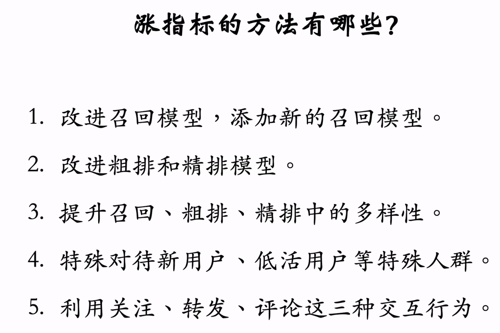
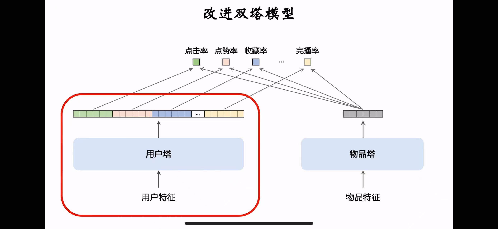

# Recommendation Systems Learning
# Part 1: Overview
召回 -> 粗排 -> 精排 -> 重排

## 1. 召回 （Candidate Generation）
	•	目标：从海量物品中快速筛选出一个规模较小但相关性较高的候选集。
	•	特点：
	•	对效率要求极高，通常用轻量级模型或规则。
	•	常用方法：协同过滤、Embedding 向量相似度、用户-物品共现矩阵、热度排序、用户行为规则。
	•	规模：从几十万到几百万条候选集压缩到几千条

已经小红书为例，一般召回阶段使用很多召回通道得到几千个笔记，然后做去重和过滤（过滤掉用户不感兴趣都作者和内容等）

## 2. 粗排（Pre-Ranking）
 主要用户小型机器学习对笔记打分，根据得分进行排序。这阶段笔记很多，所以小红书模型效率更快。

	•	目标：进一步过滤候选集，初步排序。
	•	特点：
	•	模型复杂度适中，兼顾效率和效果。
	•	通常使用轻量级机器学习模型（如LR、GBDT等）。
	•	特征主要来源于用户基本属性和行为数据的统计特征。
	•	规模：从几千条候选集筛选到几百条。

## 3. 精排（Ranking）
使用大型神经网络继续评分排序

	•	目标：对粗排结果进行精细排序，以提高推荐效果。
	•	特点：
	•	使用复杂模型，关注用户兴趣的精准匹配。
	•	常用方法：基于深度学习的排序模型（如DNN、Wide&Deep、DIN、Transformer等）。
	•	特征丰富，可能包括用户个性化特征、物品特征、上下文特征、交叉特征等。
	•	规模：从几百条候选集最终筛选出几十条。

## 4. 重排（Re-Ranking）
主要考虑多样性，对精排结果随机抽样，并按规则打乱，然后插入广告等内容

	•	目标：在精排结果的基础上进一步优化，兼顾业务需求。
	•	特点：
	•	考虑多目标平衡（如点击率、转化率、覆盖率、多样性、时效性等）。
	•	融合业务规则（如去重、特定物品曝光限制等）。
	•	可能使用多目标优化模型或规则调整。
	•	规模：最终选择几条或几十条进行推荐展示。

常用MMR和DDP等算法进行多样性抽样，然后根据规则打散相似的样本，

一般粗排精排的模型会使用用户特征，物品特征等作为输入，输出则是模型预测的点击率，点赞率，收藏率等指标，然后需要融合这些指标进行最终分数评估。

## 5. 推荐系统 ab test
一般先离线实验，如果反馈正向----
小流量线上ab test----
全量上线

随机分流部分可以用户哈希函数对用户id进行映射（可以认为哈希映射结果是接近随机的），比如
hash（id）=id%3，保证id接近的用户经过映射后的整数耶会相差很多。
然后将哈希后的整数进行分桶，比如100个用户分10桶，每个桶10用户

流量不足的处理：分层实验
比如不同阶段分为不同层（召回蹭，粗排层等），同层的实验互斥，不同层正交。一个用户不能同时受两个召回实验影响，但可以同时召回和粗排实验。

一般同类策略（如精排的两种结构）天然互斥，或两个类型相同的召回实验可能会互相增强或抵消，对于一个用户只能用其中一种。而不同层一般不会互相干扰，可以进行正交（同时参与召回和粗排实验）


## 6. 反转实验
一些指标（点击，交互等）可以立刻收到新策略影响，而另一些比如留存率等，存在滞后性。

反转实验是指：在新的推全层上保留一个小的反转桶，使用旧策略，长期观察新旧策略的diff来评估某些有滞后性的指标变化


## 7. 冷启动：Cold Start
**冷启动（Cold Start）**是推荐系统中一个常见的问题，指的是在用户或物品缺乏足够历史数据的情况下，推荐系统难以有效生成个性化推荐的情况。冷启动问题通常发生在以下几种场景中：

---

### **1. 冷启动的类型**

#### **（1）用户冷启动**
- **场景**：新用户刚注册，没有任何交互行为（如浏览、点击、购买等），系统无法准确了解其兴趣和偏好。
- **影响**：系统无法为新用户生成个性化推荐，容易推荐热门物品或随机推荐，导致推荐精准度较低。

#### **（2）物品冷启动**
- **场景**：新物品刚上线，没有任何用户与其交互记录。
- **影响**：系统无法将新物品推荐给合适的用户，可能导致新物品曝光不足或滞销。

#### **（3）系统冷启动**
- **场景**：一个新上线的推荐系统缺乏足够的用户和物品交互数据。
- **影响**：系统难以构建有效的推荐模型。

---

---

### **2. 冷启动问题的常见挑战**

1. **数据不足**：
   - 缺乏用户和物品交互数据，推荐模型难以训练或生成有效嵌入。

2. **推荐精准度低**：
   - 冷启动阶段通常依赖规则或热门推荐，个性化效果较差。

3. **用户流失风险**：
   - 冷启动阶段推荐质量低，可能导致用户流失。

4. **多样性和公平性问题**：
   - 新物品可能缺乏曝光机会，推荐结果容易集中在已有热门物品上。

---

### **3. 冷启动的解决策略总结**

| **冷启动类型**    | **方法**                                                                                   | **优点**                               | **缺点**                                   |
|------------------|------------------------------------------------------------------------------------------|----------------------------------------|-------------------------------------------|
| **用户冷启动**    | 用户画像、兴趣问卷、热门推荐、基于相似用户的推荐                                            | 快速了解新用户兴趣                     | 个性化不足，初期推荐效果可能较差            |
| **物品冷启动**    | 基于内容推荐、规则驱动、相似物品协同过滤、探索性推荐                                        | 快速曝光新物品                         | 曝光效果依赖物品特征的质量                 |
| **系统冷启动**    | 引入外部数据、多策略结合、探索性模型                                                       | 有助于快速收集数据                     | 难以平衡探索与推荐质量                     |

---


# Part 2: Recall
召回是推荐系统第一个阶段，用于从海量物品中快速筛选出一个规模较小但相关性较高的候选集。召回阶段的目标是尽可能多地覆盖用户的兴趣，同时保证召回的准确性和效率。


以电商推荐系统为例，可能的召回处理流程如下：

1. **多通道召回**：
   - **协同过滤**：从用户历史购买记录召回相似物品（Item CF）。
   - **双塔模型**：结合用户画像和物品多模态特征，生成个性化召回。
   - **热门推荐**：补充近期销量或浏览量高的热门物品。
   - **新品召回**：加入近期上架的新品。

2. **候选合并**：
   - 合并各通道结果，赋予不同通道权重（如双塔模型权重最高）。

3. **去重与过滤**：
   - 去除重复物品，过滤掉已购买或不符合推荐条件的物品。

4. **排序优化**：
   - 使用排序模型综合考虑用户兴趣、物品特征和业务规则，生成最终推荐列表。

---

### **总结**
- **多通道召回**是推荐系统提升覆盖率和多样性的关键策略，不同通道方法侧重于不同场景和问题。
- 合并召回结果时需要考虑通道权重、去重和排序优化，以确保推荐结果既精准又多样。
- 最终的召回结果为后续的排序阶段提供高质量的候选集，从而优化用户体验和业务目标。

## 1. 协同过滤（Collaborative Filtering）
    •	思想：根据用户的历史行为，找到与用户历史行为相似的物品，将这些物品推荐给用户。
    •	优点：简单、易于实现。
    •	缺点：无法利用用户的个性化信息，容易出现热门物品的推荐。
    •	算法：主要包括基于物品的协同过滤算法、基于用户的协同过滤算法、基于模型的协同过滤算法等。

### 1.1 Item Based CF
每个用户交互过很多item，如果用户喜欢item1，并且item1和item2相似，那么用户可能也会喜欢item2。

该方法首先需要计算item之间的相似度，然后预估用户对未交互item的评分，最后根据评分进行推荐。

#### User-Item Matrix
|        | Item1 | Item2 | Item3 | Item4 | Item5 |
|--------|-------|-------|-------|-------|-------|
| User1  | 5     | 3     | 0     | 0     | 2     |
| User2  | 2     | 0     | 0     | 1     | 4     |
| User3  | 0     | 0     | 4     | 3     | 0     |

该矩阵表示不同用户对不同item的评分（兴趣），比如click算1分，like算2分，share算3分等，计算每个用户对每个item的评分，得到矩阵。

#### Item-Item Similarity
计算item之间的相似度，一般使用余弦相似度等方法，得到item之间的相似度矩阵。

|        | Item1 | Item2 | Item3 | Item4 | Item5 |
|--------|-------|-------|-------|-------|-------|
| Item1  | 1     | 0.8   | 0.2   | 0.4   | 0.6   |
| Item2  | 0.8   | 1     | 0.3   | 0.5   | 0.7   |

通过该矩阵，输入itemID，可以查找出k个最相似的item，然后根据用户对这些item的评分，预测用户对该item的评分。

#### 线上召回：
- 给定用户id，通过User-Item Matrix查找用户交互过的item（n个），
- 然后通过Item-Item Similarity查找每个item的k个最相似item（k个），
- 对于取回的item（n*k个），预估用户对这些item的评分，排序后取topN作为召回结果。

通过这两个矩阵的索引可以避免枚举所有item，离线计算量大，但离线计算完成后储存结果，线上查询效率高。

### 1.2 Swing 召回
item Based CF存在问题：当与两个item交互的用户存在一个小圈子中，那么很可能这两个item相似度很高，
但是实际上可能是因为小圈子用户重叠导致的，而不是因为item本身相似。

如果大量不相关用户交互两个item，说明这两个item可能有相同受众。

Swing模型就是通过给用户设置权重，通过在相似度计算公式添加用户重合比例权重，若两个item重合用户比例高，则分母上该权重变大，
总相似度降低，从而避免小圈子效应。


### 1.3 User Based CF
与Item Based CF类似，计算用户之间的相似度，然后根据已知用户对item的评分，预测新用户对item的评分。

- 该算法考虑的一个点：热门item对相似度的影响，如果一个item很热门，那么很多用户都会交互，该item实际对用户相似度计算的价值不高。因此需要对热门item进行权重调整。
- 冷门item更能反映出用户相似度，若两个user都对一个冷门item有交互，那么这两个user的相似度更高。
- 总结：热门item降低权重后计算user similarity，然后根据user similarity预测用户对item的评分。

整体流程和Item CF类似：
- User-Item Matrix：用户对item的交互
- User-User Similarity：用户之间的相似度

线上召回：
- 给定用户id，通过User-User Similarity查找用户相似度最高的k个用户，
- 通过User-Item Matrix查找这k个用户近期交互的item（last-n）
- 对于取回的item，预估用户对这些item的评分，排序后取topN作为召回结果。


## 2. 双塔模型


双塔模型是一种基于Embedding的召回模型，通过Embedding向量表示用户和item，然后计算用户和item的相似度，最后根据相似度进行召回。
该方法是传统协同过滤的一种改进，工业界常用。

**双塔模型**(Two-Tower Model)是一种常用于推荐系统和信息检索中的深度学习架构，旨在高效处理大规模用户与物品（User-Item）匹配问题。它通过分别为用户和物品构建独立的特征表示向量，
并在匹配阶段计算二者的相似性（例如内积或余弦相似度）作为**兴趣评分的预测值**，从而完成推荐或检索任务。

---

### **双塔模型的结构**
双塔模型通常由两部分组成：用户塔（User Tower）和物品塔（Item Tower）。它们的作用如下：

1. **用户塔（User Tower）**
   - 用于提取用户特征的表示向量（Embedding）。
   - 输入数据包括用户ID、历史行为（如点击、购买记录）、上下文特征（如时间、地理位置）等。
   - 通过嵌入层（Embedding Layer）和若干全连接层（或其他神经网络结构）生成用户特征向量。

2. **物品塔（Item Tower）**
   - 用于提取物品特征的表示向量（Embedding）。
   - 输入数据包括物品ID、属性特征（如品类、价格、描述）等。
   - 同样通过嵌入层和若干全连接层生成物品特征向量。

3. **相似性计算**
   - 用户塔和物品塔输出的向量通常在一个共享的嵌入空间中。
   - 通过计算用户向量和物品向量的相似度（如内积或余弦相似度），衡量二者的匹配程度。

4. **优化目标**
   - 使用负采样策略构建正负样本对，采用目标函数（如二分类交叉熵或最大化相似度）进行训练。

---

### **双塔模型的优势**
1. **高效性**
   - 双塔模型解耦了用户和物品的特征提取，计算复杂度低。
   - 在离线阶段，物品向量可以提前计算并索引，仅需在线计算用户向量和物品的相似性即可完成推荐。

2. **扩展性**
   - 支持海量用户和物品的推荐任务。
   - 特别适用于检索场景中需要快速匹配的情况（如召回阶段）。

3. **灵活性**
   - 用户塔和物品塔可以独立设计，支持多样化的输入特征和网络结构。

---
    
### **双塔模型的不足**
1. **特征独立性限制**
   - 用户塔和物品塔独立训练，难以捕捉用户和物品之间复杂的交互关系。
   - 解决方案：可以在召回后通过排序模型补充交互信息。

2. **冷启动问题**
   - 对于缺乏历史行为的新用户或新物品，双塔模型可能无法生成准确的向量。
   - 解决方案：引入基于内容的特征（如用户画像、物品属性）缓解冷启动问题。

3. **潜在表达能力不足**
   - 双塔模型假设用户和物品可以通过简单的相似性度量匹配，可能无法满足某些复杂场景的需求。

双塔模型主要通过对用户和item分别进行多特征维度的嵌入（分类特征进行embedding，连续变量进行归一化或分桶等处理），使用神经网络进行特征提取，最后得到每个用户和item的嵌入向量，再分别计算
User-Item的相似度，最后根据相似度进行召回。

### 双塔模型的训练


| 方法       | **样本处理方式**                              | **正负样本关系**                                        |
|------------|-----------------------------------------|--------------------------------------------------------|
| **Pointwise** | 独立处理每个样本，将正样本和负样本看作独立的二分类或回归任务。         | 无需比较，正负样本之间无直接关系。                       |
| **Pairwise**  | 每次取一个用户，一个正样本物品和一个负样本物品，通过构造正负样本对来优化模型。 | 强调正负样本对的相对关系，目标是正样本得分高于负样本。     |
| **Listwise**  | 每次取一个用户，一个正样本物品和多个负样本物品                 | 同时考虑多个正负样本之间的全局排序关系，直接优化排名指标。 |

---
####  **总结**
- **Pointwise** 独立看待正负样本，适合简单的二分类或回归问题。
- **Pairwise** 强调正负样本对之间的相对关系，适合优化排序。
- **Listwise** 同时处理多个正负样本，从全局优化排序效果，适合需要整体排名的场景。


对于PairWise，基本思想是鼓励cos（a，b+）>cos（a，b-），
损失函数为：
- Triplet Hinge Loss： max(0, margin + cos(a, b-) - cos(a, b+))
  - margin为超参数，一般取1
- Triplet Log Loss： log(1 + exp(cos(a, b-) - cos(a, b+)))


## 3. 召回模型训练时的正负样本选择


### 3.1 简单负样本
指的是未被召回的物品，大概率是用户不感兴趣都，约等于全体物品（大部分都不会被召回），因此：
- 直接对全体物品进行抽样，作为负样本。
- 由于正样品大部分为热门物品，如果均匀抽样会导致产生的负样本大多是冷门物品，因此需要非均匀抽样（减少热门物品对冷门物品的影响）
- 非均匀抽样：负样本抽样概率应该与热门程度（如点击次数）正相关---
  - 抽样概率 = （点击次数）^α，α为超参数，一般取0.75
  - 点击次数越高，抽样概率越大，但不是线性关系

### 3.2 困难负样本
指的是排序（粗排，精排）阶段被淘汰的样本。这样的样本已经被召回了，即用户有一定的兴趣，只是被排序截断。这样的样本容易被误分类为正样本。
- 工业界一般进行负样本混合：用简单负样本和困难负样本混合作为负样本用于训练

#### 负样本的错误选择：
对于召回模型，只能使用上述的easy/hard负样本（源于召回和排序阶段），但不能使用已经曝光但没有点击的样本作为负样本。
- 已经曝光但样本表示该样本已经经过一些列链路在重排后展示给用户，可能用户只是恰好没有点击；
- 召回模型目的是区分用户感兴趣或不感兴趣，而不是区分用户感兴趣或更感兴趣；
- 曝光的样本是我们认为用户感兴趣的部分，应该属于正样本。**这些样本可以用于排序模型作为负样本。**

## 4. 双塔模型线上召回和更新

- 训练好双塔模型后，离线储存item塔的向量（向量数据库），即每个item的特征向量b
  - 对item向量库建立索引，便于加速最近邻查找
- 线上召回：
  - 用户发起推荐请求
  - 线上神经网络根据用户id和画像（特征），实时计算用户向量a
  - 使用用户向量a作为query，通过item向量库查找最相似的k个item
  - 这些item会和CF，swing等通道进行融合，作为最终召回结果

### 为什么用户向量实时计算，而item向量离线储存？
- 每次召回只需要计算一个用户向量，而需要从几亿个item中进行召回
- 计算一个用户向量a是可接受的实时计算，而item向量过大，只能采取离线存储并查找的手段。
- 而实时计算用户向量可以根据用户兴趣变化而动态推荐，item的向量相对稳定，不需要频繁调整。

## 5. 全量更新 & 增量更新


**注意**：每次全量更新使用的模型是基于上一次全量更新的checkpoint，增量更新的模型会被丢弃，不会被用于下一次全量更新。

### 全量更新
- 每天凌晨使用昨天的数据重新训练双塔模型，
- 在昨天的参数上继续训练（不是随机初始化），训练一个epoch一般，
- 发布新的用户塔神经网络以及更新item向量库。

### 增量更新
online learning更新模型参数，让模型在用户交互后几小时内就能反映用户兴趣变化
- 实时收集线上数据，做流式处理，生成TFRecord文件；
- 对模型做online learning，增量更新ID Embedding参数（不更新其他参数）
- 即从早到晚不断生成训练数据，不断进行梯度下降更新embedding层，冻结其余全连接层
- 发布用户ID Embedding，供用户塔神经网络实时计算用户向量。

### 能否只做增量更新而不做全量？
- 如果只做增量更新，由于小时间段内数据是有偏的（用户的兴趣变化大），可能会导致模型过拟合，因此需要全量更新来平衡模型的泛化能力和精确度。
- 全量更新时需要random shuffle全天数据，做1 epoch训练；而增量更新可以看作是时间序列数据，并没有打乱。


## 6. Deep Retrieval
区别于双塔模型（向量召回，将用户和item都嵌入为向量后进行query），Deep Retrieval基于路径进行召回

## 7. 其他召回通道
### 1. 地理位置召回
- GeoHash召回：思想是用户可能对附近发生的事感兴趣，对经纬度编码（二进制哈希码），geohash作为key，item作为value
  - 该方法召回只关注用户自身地理位置，并没有个性化
- 同城召回：召回同一城市的item信息

### 2. 作者召回
- 用户对某个作者感兴趣（关注该作者），索引为：
  - 用户--作者
  - 作者--item（按时间倒排，最新的排在最前面）
  -  召回形式：用户-->作者-->item

- 也可以扩展为“有交互的作者召回（点赞，收藏等）”
- 相似作者召回：
  - 作者--相似作者
  - 用户-->感兴趣的作者-->相似作者（相似度）-->item

### 3. 缓存召回
复用之前n次推荐过程中精排的结果。由于精排结果会进行重排后多样性抽样，最终给用户的item只是精排结果的一部分；
精排中还有很多item并没有展示，可以将这些item作为缓存召回的候选集。
- 由于缓存大小固定，需要退场机制
- 比如一旦笔记曝光成功，需要从缓存中删除
- 如果缓存大小达到上限，先移除最先进入缓存的item

## 7.曝光过滤--Bloom Filter
需要对已曝光的item进行记录，保证下一次重拍后推荐给用户的item是没被曝光过的。一般使用Bloom Filter进行过滤。

可以设置时间限制，比如超出一个月的item就从物品集移除，减少误删未曝光物品的概率。


# Part 3: Ranking
Ranking 包括：粗排、精排、重排；促排和精排原理相似，都是使用模型对item进行打分后排序，只是粗排模型要简单，计算效率高，需要从大量recall的结果中筛选截断一部分；
而精排模型更复杂，需要更多的特征，更多的计算，但是效果更好。

## 1. Multi-task Learning：多任务学习
用户-物品交互数据是推荐系统中的重要信息，包括用户的点击、购买、收藏、点赞等行为。这些交互数据反映了用户对物品的兴趣和偏好，是推荐系统训练模型的重要数据来源。
- impression：曝光，用户看到了该物品
- clicks: 用户点击物品的行为（点击率=点击次数/曝光次数）
- likes：用户点赞物品的行为（点赞率=点赞次数/点击次数）
- collect：用户收藏物品的行为（收藏率=收藏次数/点击次数）
- shares：用户分享物品的行为（分享率=分享次数/点击次数）

### 排序的依据
使用Ranking Model预估点击率（CTR），点赞率等指标分数，通过加权和等方式融合分数后对分数进行排序，截断topN作为推荐结果。

### 精排模型核心：shared bottom


一般如上图所示：
- 将不同特征进行concat，然后使用一个神经网络（可以是全连接或wide&deep或其他结构），得到一个嵌入表征向量
- 将该向量分别输入四个不同的下游模型，分别预测点击率，点赞率，收藏率，分享率等指标
- 最后将这四个指标融合，得到最终的排序分数

上述模型的优点：
- shared bottom：模型大，需要对融合后的特征进行表征
- 属于**前期融合**：先对所有特征进行concatenation再输入神经网络
- 线上推理代价大：给n个item打分需要推理n次

#### 双塔模型属于后期融合：先对不同特征输入不同神经网络，不直接融合特征。优点是线上推理计算量小，用户塔只需要计算一次用户表征a；
#### 物品表征b可以离线推理后储存在向量数据库，线上推理的时候直接使用

### 排序模型的训练


yi是用户的行为（0或1），pi是子网络的预测值（0-1之间）。对于每个子网络相当于做二分类。

面对的困难：不平衡。一般常用对**负样本下采样**。
- 原始正负样本数为n+,n-
- 负样本下采样，使用采样率α，则采样后负样本数为αn-
- 由于负样本变少，**预估的指标（点击率）会大于真实点击率，需要进行校准**


### **1. 预估值校准的作用**
预估值校准的目标是让模型的输出分数更接近实际概率（真实点击率 \(p_{\text{true}}\)），而不仅仅是一个用来排序的相对分数。这在以下场景中可能是必要的：

#### **（1）需要解释性**
校准后的分数可以更直观地解释。例如，如果校准后的预测值是 0.7，那么可以解释为“该用户点击的概率为 70%”。这对业务分析或用户反馈很有帮助。

#### **（2）跨任务或跨模型的一致性**
- 如果你的系统有多个目标（如点击率、购买率等），校准分数可以确保不同任务的评分在同一范围内（比如概率范围 [0, 1]）。
- 在多个模型融合（如排序模型与过滤模型结合）时，校准分数可以统一不同模型的分数尺度，避免因分数范围不同引入偏差。

#### **（3）对决策产生影响**
对于某些推荐系统，不仅仅需要排序结果，还需要使用分数来调整推荐策略。例如：
- 在 **多目标优化** 中，可能需要根据校准后的概率分数加权不同目标的重要性。
- 在 **广告竞价系统** 中，校准后的点击率直接参与收益计算（例如计算预期收益）。

---

### **2. 校准对排序的影响**
从排序模型的角度，如果仅仅关心排序结果，相对大小比绝对值更重要，因此校准并不总是必要。但有以下情况需要考虑：

#### **（1）截断点的位置选择**
排序模型通常需要预测所有候选物品的分数后，选择前 \(k\) 个结果。如果分数未校准且范围偏移严重，可能会影响截断点附近物品的排序质量。例如：
- 未校准的分数可能导致前 \(k\) 个物品和第 \(k+1\) 个物品之间的分数差异不具有实际意义。

#### **（2）样本偏置问题**
排序模型训练时往往使用点击数据，但点击数据通常存在样本偏置（例如展示过的内容被点击的概率远高于未展示内容）。校准可以一定程度上缓解这种偏置，提升预测结果在未展示样本上的鲁棒性。

---

### **3. 校准的必要性分析**
校准是否必要，具体取决于你的应用场景：

| **场景**                                      | **校准是否必要**                    | **原因**                                                                 |
|-----------------------------------------------|-------------------------------------|--------------------------------------------------------------------------|
| **仅关心排序准确性**                          | 不必要                              | 排序仅需要分数的相对大小，校准后的绝对值对结果影响不大。                  |
| **需要概率解释（如CTR解释）**                 | 必要                                | 校准后的分数可以反映实际点击概率，增强模型的可解释性。                   |
| **多任务模型需要融合分数（如点击率+转化率）** | 必要                                | 统一分数尺度有助于加权融合不同目标。                                      |
| **需要跨模型融合（如召回模型与排序模型结合）** | 必要                                | 保证不同模型的输出分数在同一量纲内，有利于融合逻辑。                      |
| **广告竞价或收益优化**                        | 必要                                | 预测值需直接用于收益计算，因此校准后的概率分数是必要的。                   |

## 2. MMoE: Multi-gate Mixture-of-Experts


**MMoE**（**Multi-gate Mixture-of-Experts**）是一种多任务学习（Multi-task Learning）的深度学习模型架构，广泛应用于推荐系统、广告点击率预测等场景，尤其在多目标任务中非常高效。它通过共享专家网络（Experts）和任务特定的门控网络（Gate）来提升多任务建模能力，同时解决多任务之间的冲突问题。

---

### **1. MMoE 的核心思想**
在多任务学习中，任务之间可能存在竞争或冲突，例如推荐系统中“点击率预测”（CTR）和“转化率预测”（CVR）可能对特征的关注点不同。MMoE 引入了**专家共享机制**和**任务特定的门控网络**，使每个任务可以选择性地利用专家的知识，而不是完全共享或完全独立。

---

### **2. 模型结构**

MMoE 模型由以下几个模块组成：
**示例结构**：
```text
         Input Features
             ↓
      ┌───────────────┐
  Expert 1   Expert 2   ...  Expert N
      │         │               │
  ┌───▼───┐ ┌───▼───┐     ┌────▼────┐
  Gate 1   Gate 2   ...     Gate T
      │         │               │
 Task 1     Task 2           Task T
```

#### **（1）Shared Experts（共享专家网络）**
- 多个专家网络（通常是全连接神经网络）用于提取特征，捕捉特征的潜在表示。
- 专家网络是所有任务共享的，但并非每个任务都使用所有专家的输出。

#### **（2）Task-specific Gates（任务特定的门控网络）**
- 每个任务有一个独立的门控网络，用于对共享专家的输出进行加权。
- 门控网络输出一组权重，表示当前任务对各个专家的依赖程度。
- **Softmax** 用于生成归一化权重，最终对专家的输出进行加权求和，作为每个任务的输入。

#### **（3）Task Towers（任务特定网络）**
- 每个任务有自己的网络，用于根据门控网络输出的特征进一步优化。
- 任务特定网络的输出通常是该任务的预测值（例如点击率或转化率）。

---

### **3. 模型流程图**
MMoE 的整体架构可以总结如下：

```
输入特征
   ↓
共享专家网络（多个专家）
   ↓
任务 A 的门控网络  → 专家加权 → 任务 A 的特定网络 → 任务 A 的输出
任务 B 的门控网络  → 专家加权 → 任务 B 的特定网络 → 任务 B 的输出
...
```

- **共享专家**：负责提取基础特征表示。
- **任务门控**：为每个任务选择最合适的专家。
- **任务网络**：根据加权后的特征进行预测。

---

### **4. 代码实现（PyTorch）**

以下是一个简单的 MMoE 实现：

```python
import torch
import torch.nn as nn

class MMoE(nn.Module):
    def __init__(self, input_dim, expert_num, expert_hidden_dim, task_num, task_hidden_dim):
        super(MMoE, self).__init__()
        self.expert_num = expert_num
        self.task_num = task_num
        
        # 定义专家网络
        self.experts = nn.ModuleList([
            nn.Sequential(
                nn.Linear(input_dim, expert_hidden_dim),
                nn.ReLU()
            ) for _ in range(expert_num)
        ])
        
        # 定义任务门控网络
        self.gates = nn.ModuleList([
            nn.Linear(input_dim, expert_num) for _ in range(task_num)
        ])
        
        # 定义任务特定网络
        self.towers = nn.ModuleList([
            nn.Sequential(
                nn.Linear(expert_hidden_dim, task_hidden_dim),
                nn.ReLU(),
                nn.Linear(task_hidden_dim, 1),
                nn.Sigmoid()
            ) for _ in range(task_num)
        ])
    
    def forward(self, x):
        # 专家网络的输出
        expert_outputs = torch.stack([expert(x) for expert in self.experts], dim=1)  # [batch_size, expert_num, hidden_dim]
        
        # 各任务的输出
        task_outputs = []
        for i, gate in enumerate(self.gates):
            gate_weights = torch.softmax(gate(x), dim=1)  # [batch_size, expert_num]
            
            # einsum:矩阵乘法
            # gate_weights: [batch_size, expert_num], 
            # expert_outputs: [batch_size, expert_num, hidden_dim]
            # gate_output: [batch_size, hidden_dim]
            gate_output = torch.einsum('be,beh->bh', gate_weights, expert_outputs)  # [batch_size, hidden_dim]
            task_output = self.towers[i](gate_output)  # [batch_size, 1]
            task_outputs.append(task_output)
        
        return task_outputs  # 每个任务的预测值

# 示例输入
input_dim = 64
expert_num = 4
expert_hidden_dim = 32
task_num = 3
task_hidden_dim = 16

model = MMoE(input_dim, expert_num, expert_hidden_dim, task_num, task_hidden_dim)
x = torch.rand(32, input_dim)  # 32个样本
outputs = model(x)

# 输出
for i, output in enumerate(outputs):
    print(f"Task {i+1} Output Shape: {output.shape}")
```

### 5. Polarize:极化现象
MMoE的Gate使用Softmax输出权重，而权重可能导致极化现象，即某个专家权重接近1，其他接近0。这样导致某些expert是死亡的，变成
普通多目标模型，而并没有融合多专家。

解决方案：专家Dropout
- 引入动态机制，在每次训练中随机屏蔽部分专家的输出（类似 Dropout），迫使门控网络选择更多的专家。这种方法可以有效减少专家极化现象。

## 3. PLE: Progressive Layered Extraction
**PLE（Progressive Layered Extraction）** 和 **MMoE（Multi-gate Mixture-of-Experts）** 是两种常见的多任务学习（MTL）框架，主要用于解决多任务推荐或多目标优化问题。这两种方法有一定相似性，但设计思想和应用场景有所不同。以下是两者的详细对比：

---

### 1. 基本概念
- **核心思想**：
  - 在 MMoE 的基础上，进一步将**共享专家**和**任务特定专家**分离，并引入分层特征提取结构。
  - 通过多层次专家网络对特征逐步提炼，解决任务冲突问题，同时保留任务间协同效应。
- **优点**：
  - 更好地缓解任务冲突问题。
  - 能同时建模任务相关性和任务独立性。
- **缺点**：
  - 模型复杂度更高，计算成本相较 MMoE 增加。

---

### **2. 网络架构**


---

#### **PLE 的架构**
1. **共享专家**提取可供所有任务共享的特征。
2. **任务特定专家**提取专属于每个任务的特定特征。
3. 每一层通过门控机制动态选择特征来源，并将上一层的输出逐层输入下一层，实现逐步特征提取。
4. 通过分层设计，逐步将特征分解为任务共享部分和任务特定部分。

**示例结构**：
```text
          Input Features
               ↓
 ┌──────── Shared Experts ────────┐
 │                                │
 Task A Experts          Task B Experts
       ↓                        ↓
      Gate A                  Gate B
       ↓                        ↓
   Task A Output            Task B Output
```

---


#### **PLE 示例代码**
```python
class PLE(nn.Module):
    def __init__(self, input_dim, expert_num, expert_dim, task_num):
        super(PLE, self).__init__()
        # 共享专家网络
        self.shared_experts = nn.ModuleList([
            nn.Sequential(
                nn.Linear(input_dim, expert_dim),
                nn.ReLU()
            ) for _ in range(expert_num)
        ])
        # 每个任务的特定专家网络
        self.task_experts = nn.ModuleList([
            nn.ModuleList([
                nn.Sequential(
                    nn.Linear(input_dim, expert_dim),
                    nn.ReLU()
                ) for _ in range(expert_num)
            ]) for _ in range(task_num)
        ])
        # 门控网络
        self.gates = nn.ModuleList([
            nn.Linear(input_dim, expert_num * 2) for _ in range(task_num)
        ])
        # 任务特定塔层
        self.towers = nn.ModuleList([
            nn.Sequential(
                nn.Linear(expert_dim, 1),
                nn.Sigmoid()
            ) for _ in range(task_num)
        ])

    def forward(self, x):
        # 获取共享专家的输出
        shared_outputs = torch.stack([expert(x) for expert in self.shared_experts], dim=1)
        task_outputs = []
        for i, task_expert in enumerate(self.task_experts):
            # 获取任务特定专家的输出
            task_specific_outputs = torch.stack([expert(x) for expert in task_expert], dim=1)
            # 拼接共享专家和任务特定专家的输出
            all_expert_outputs = torch.cat([shared_outputs, task_specific_outputs], dim=1)
            # 门控机制
            gate_weights = torch.softmax(self.gates[i](x), dim=1)
            gate_output = torch.einsum('be,bne->bn', gate_weights, all_expert_outputs)
            # 任务特定塔层输出
            task_outputs.append(self.towers[i](gate_output))
        return task_outputs
```

#### 关于Experts 和 Gates：
对于MMoE和PLE的Experts，一般来说每个下游任务有一个gate，该gate对所有experts进行加权。而PLE有一些shared experts用于所有任务，
还有一些task-specific experts用于特定任务。

## 4. 预估分数融合
### 1. 线性加权

简单加权：直接对不同任务的预估分数进行加权求和，得到最终的排序分数。
- score = p_click+w1*p_like+w2*p_collect+w3*p_share

点击率乘其他项的加权
- score = p_click*(1+w1*p_like+w2*p_collect+w3*p_share)

### 2. 快手的分数融合


### 3. 电商的分数融合


## 5. 视频播放建模
- 图文item排序主要依靠：点击，点赞，收藏，分享等行为，
- 视频播放建模主要依靠：播放时长，播放次数，播放完成率等指标。（直接做时长回归模型效果不好）
### 播放时长建模


- 上图所示，最右边的全连接层是播放时长的输出（其他是点击率，点赞率等）；
- 对z做sigmoid变化得到p，训练的时候用y=t/(1+t)作为label，用CE(y,p)作为损失函数;
- 推理的时候只使用exp(z)，因为CE会最小化p和y的差距，那么可以认为exp(z)和t的差距也会很小。即时长t=exp(z)。
- 通过这种方式，可以将时长回归问题转化为二分类问题，提高模型的泛化能力。
- 将exp(z)作为预估分数融合中的一项，影响视频item的排序。

### 完播率建模
- 回归方法：播放长度/视频长度作为label，p为预估播放率
  - loss = y*log(p)+(1-y)*log(1-p)
  - 如果p=0.73：预计播放长度为73%的视频长度

- 二分类：将完播80%的视频作为正样本，其他作为负样本，使用CE作为损失函数
  - 如果p=0.73：P(播放>=80%)=0.73，即73%的概率播放长度>=80%的视频长度

实际操作不可以直接用完播率作为融分公式的一项，因为完播率和播放时长有相关性，视频时长长的视频完播率可能较低。
- 对完播率预估值进行adjust：p_adjust = p/f(视频长度)，f(视频长度)是视频长度的函数，可以是线性函数，也可以是其他函数。
- 视频长度越长，f越小，p_adjust越大，即视频长度越长，完播率得分倾向于更高
- 将p_adjust作为融分公式的一项，影响视频item的排序。

## 6. 排序模型的特征
### 1. 用户画像 User Profile
- UID: 在召回，排序中进行embedding，一般用32维或64维向量
- 统计学属性：性别，年龄等
- 账号信息：新老用户，活跃度等
- 用户感兴趣类目：关键词，品牌等

### 2. 物品画像 Item Profile
- 物品id：embedding
- 发布时间：一般时间越长的物品，权重越低（更关注近期内容）
- GeoHash（经纬度编码），所在城市等
- 物品内容：标题，类目，关键词，品牌等（一般是分类变量，做embedding）
- 物品特征：字数，图片数，视频清晰度，标签是数等，反应item质量
- 内容信息量，图片美学等：使用cv，nlp模型对这些特征打分并融入item画像作为特征

### 3. 用户统计特征
- 用户在不同时间粒度下的点击数，点赞数等
- 用户分别对图文item，视频item的点击率等，反应对不同item的偏好
- 对item类目的点击率：比如对美妆类，科技类等细分领域维度

### 4. 笔记统计特征
- 笔记在不同时间的曝光数，点击数等
- 按照item受众分桶，比如item来自不同性别用户，不同年龄用户的点击
- 作者特征：作者发布的item数，粉丝数，消费指标（item的曝光数，点击数点赞数等）

### 5. 场景特征 Context
- 用户定位GeoHash
- 当前时刻：分段做embedding
- 是否是周末，节假日等
- 手机品牌，手机型号，操作系统（比如安卓和苹果用户的点赞率等指标有显著差异）

### 特征处理
- 离散特征：embedding
  - 用户id，itemId，作者ID
  - 类目，关键词，城市等
- 连续特征：分桶，变成离散特征
  - 年龄，笔记字数，视频长度等，先分桶为不同年龄组等离散特征，然后可以onehot或embedding
  - 点击数，曝光数等数值很大，可以做log变换：log(1+x)
    - 或者转换为点击率，点赞率，并做平滑处理

### 特征覆盖率
- 很多特征无法覆盖100%样本---存在缺失值；比如一些用户不填写年龄等
- 对于重要的特征，可以提高覆盖率来提高精排模型准度


## 7. 粗排 Pre-Ranking
前面部分的排序模型主要用于精排，需要高准度，单次推理代价大，同时样本量也比较小。
而粗排需要给更多item打分，单次推理代价要求小，可以牺牲一定的准度

一般前期融合（先对各种特征concatenation再输入一个shared bottom）用于精排阶段，而比如双塔模型等属于后期融合（分别将不同特征输入不同神经网络）用于粗排或召回

### 三塔模型


- 用户Tower：用户特征，场景特征
  - 对于一个用户只需要推理一次，所以用户塔可以很大，实际推理代价也不高
- 物品Tower：物品特征（静态）
  - 有n个item，每次给一个user做推荐则需要进行n次推理
  - 由于一般item属性较为稳定，可以缓存物品塔的输出向量
  - 一般线上不需要再推理，只有出现新item才需要推理
- 交叉Tower：统计特征，用户特征和物品特征交叉
  - 统计特征（点击率等）在每次交互后会变化，需要实时更新
  - 有n个item，必须做n次推理
  - 所以交叉塔需要足够小，推理代价低
- 三个Tower输出三个向量表征，对三个向量进行concatenation和cross
  - 把上述得到的一个向量分别输入不同的下游任务，输出点击率，点赞率，转发率等预估
  - 介于前期融合和后期融合之间
- 上层网络（用于输出点击率等指标的预估值）
  - 对每一个user的推荐请求，需要做n次推理，对n个item打分，代价大
  - 大部分粗排计算量都在上层网络部分

# Part 4: 特征交叉（Feature Cross）
## 1. Factorized Machine（FM）
FM是线性模型的改进，引入二阶交叉项来提升模型表达能力。FM模型的核心思想是将特征的交叉项分解为两个低维向量的内积，从而降低模型的复杂度。

## 2. DCN: Deep & Cross Network 深度交叉网络
DCN是一种结合了深度神经网络和特征交叉的模型，通过交叉层实现特征交叉，通过深度网络学习特征的高阶交叉。

之前提到的召回和排序模型中的`双塔模型`,`多目标学习模型`，`MMoE`等只是模型框架结构，其中的Tower和MMoE的shared bottom，Experts等都可以使用简单全连接网络或DCN或其他更复杂的网络结构。


### DCN的模型结构
DCN由两部分组成：
1. **交叉网络（Cross Network）**：
   - 显式学习特征的高阶交叉。
   - 通过逐层递归的方式，将输入特征进行多阶交叉组合。

2. **深度网络（Deep Network）**：
   - 使用多层感知机（MLP）学习特征的隐式交叉。
   - 包括多层全连接层，后接激活函数（如ReLU）。

3. **联合输出层**：
   - 将交叉网络和深度网络的输出进行融合（如拼接），最终接入一个全连接层，用于最终预测。


### 1. Cross Layer
深度交叉网络（Deep Cross Network, DCN）是一种用于特征交叉与组合的深度学习模型，常用于推荐系统和广告点击率预估任务中。DCN 的目标是通过高效地学习特征交叉来捕捉特征之间的非线性关系，从而提高模型的预测效果。
- x_i+1 = x_0 * (W*x_i + b_i) + x_i
- W*x_i + b_i是一个全连接层，x_0是输入特征，x_i是交叉层的输出，x_i+1是下一层的输入


### 2. Code Implementation
```python
class CrossLayer(nn.Module):
    """
    Cross Layer for explicit feature crossing
    """
    def __init__(self, input_dim):
        super(CrossLayer, self).__init__()
        self.weight = nn.Parameter(torch.randn(input_dim, 1))  # Learnable weight
        self.bias = nn.Parameter(torch.randn(input_dim))      # Learnable bias

    def forward(self, x0, xl):
        # Cross layer computation: x_{l+1} = x0 * (w^T * xl) + b + xl
        cross_term = torch.matmul(xl, self.weight)  # (batch_size, 1)
        cross_term = x0 * cross_term                # Element-wise product with x0
        return cross_term + self.bias + xl          # Add bias and residual connection

class CrossNetwork(nn.Module):
    """
    Cross Network: Stack of Cross Layers
    """
    def __init__(self, input_dim, num_layers):
        super(CrossNetwork, self).__init__()
        # 创建多个 CrossLayer，每一层的输入都是 (x0, xi)
        self.cross_layers = nn.ModuleList([CrossLayer(input_dim) for _ in range(num_layers)])

    def forward(self, x):
        x0 = x  # 保存初始输入 x0
        for layer in self.cross_layers:
            # 每一层接收 (x0, xi) 作为输入，x0 是初始输入，xi 是前一层的输出
            x = layer(x0, x)  # 每个 CrossLayer 的输入包括 x0 和当前的 x（上一层的输出）
        return x


class DeepNetwork(nn.Module):
    """
    Deep Network: Multi-Layer Perceptron (MLP) for implicit feature interaction
    """
    def __init__(self, input_dim, hidden_dims):
        super(DeepNetwork, self).__init__()
        layers = []
        for hidden_dim in hidden_dims:
            layers.append(nn.Linear(input_dim, hidden_dim))
            layers.append(nn.ReLU())
            layers.append(nn.Dropout(0.5))  # Optional: Dropout for regularization
            input_dim = hidden_dim
        self.mlp = nn.Sequential(*layers)

    def forward(self, x):
        return self.mlp(x)

class DCNv2(nn.Module):
    """
    DCNv2: Combines Cross Network and Deep Network
    """
    def __init__(self, input_dim, cross_layers, hidden_dims):
        super(DCNv2, self).__init__()
        self.cross_network = CrossNetwork(input_dim, cross_layers)
        self.deep_network = DeepNetwork(input_dim, hidden_dims)
        self.output_layer = nn.Linear(input_dim + hidden_dims[-1], 1)  # Final output layer

    def forward(self, x):
        # Explicit feature crossing
        cross_out = self.cross_network(x)

        # Implicit feature interaction
        deep_out = self.deep_network(x)

        # Concatenate outputs from cross network and deep network
        combined = torch.cat([cross_out, deep_out], dim=1)

        # Output layer (e.g., for binary classification or regression)
        return torch.sigmoid(self.output_layer(combined))
```

## 3. LHUC(PPNet): Learning Hidden Unit Contributions
LHUC起源于语音识别（2016），后来常用于精排模型（PPNet）。LHUC的主要目标是通过为每个隐藏单元引入一个权重系数（即“贡献”），来提高模型对输入的适应性。这些贡献系数是可以训练的参数，模型通过学习这些系数，调整每个神经单元的权重，从而在不同的输入数据上表现出更好的灵活性和表达能力。


- item feature：用简单全连接层处理得到嵌入
- user feature：用MLP处理，并连接sigmoid，将结果*2（sigmoid结果在0-1，*2后结果在0-2）
- 两者输出的向量做element-wise相乘，得到最终的特征向量
- 可以继续堆叠上述结构，得到更复杂的模型
- 实际上是使用 用户特征 来作为 可学习的权重 来调整（或“缩放”） 物品（Item）特征，这一过程可以看作是 LHUC 的一种应用
- 模型可以根据不同用户的特征，动态调整每个物品的特征表示。这可以帮助模型根据每个用户的兴趣和行为，对物品的表示进行不同程度的调整
- 通过学习和优化这些权重，模型能够更好地适应不同用户的需求，尤其是在冷启动问题或数据稀疏的情况下，能够更灵活地调整每个用户和物品的特征交互。

## 4. SENet
**SENet**（**Squeeze-and-Excitation Networks**）是一种用于提升深度学习模型性能的网络架构，最初提出用于计算机视觉任务中的图像分类。SENet的核心思想是通过 **自适应地调整通道之间的权重**，来提升模型对重要特征的关注能力，从而增强模型的表达能力。它通过引入 **Squeeze-and-Excitation** 操作，在每个卷积层后加上一个 **自适应重标定机制**，使网络可以根据输入特征的不同，自动调整通道的重要性。

### **SENet的核心思想：**

1. **Squeeze（压缩）**：首先，通过全局平均池化将输入特征图的空间维度压缩为一个通道描述符。这个描述符反映了每个通道的重要性。
   
2. **Excitation（激励）**：接着，通过一个 **全连接层（FC layer）** 和一个 **sigmoid 激活函数**，生成每个通道的 **注意力系数**。这些系数会告诉模型每个通道的重要性，即该通道对最终输出的贡献。

3. **重标定**：最后，将 **激励系数** 与原始输入特征图的每个通道相乘，来重新调整各个通道的响应。这样，模型就能更关注重要的通道特征，并抑制不重要的通道特征。

### **SENet在推荐系统中的应用：**

虽然SENet最早是为计算机视觉任务设计的，但其自适应权重调整的思想同样可以应用到 **推荐系统** 中。推荐系统通常面临着多个特征之间的相互作用，而SENet的 **通道注意力机制** 可以帮助模型动态地选择和调整哪些特征对最终预测更为重要。

在推荐系统中，SENet的主要应用可能体现在以下几个方面：

1. **特征选择与加权**：
   - 在传统的推荐系统中，用户和物品的特征通常是通过嵌入层表示的，并通过神经网络进行处理。SENet可以通过 **自适应调整** 每个特征嵌入的权重，让模型更加关注与当前用户或物品相关的特征。

2. **增强特征交互**：
   - 推荐系统中，用户和物品特征的交互非常关键，尤其是对于深度神经网络模型。SENet通过自动选择重要的特征通道，可以增强模型对于特征交互的学习能力，从而更好地捕捉 **用户-物品的复杂关系**。

3. **提高个性化推荐的效果**：
   - 每个用户的兴趣和物品的特性不同，SENet的注意力机制可以让模型更加关注用户当前偏好的物品特征和行为模式，提升 **个性化推荐** 的效果。

# Part 5: 用户行为建模
## 1. LastN模型
- 主要使用用户最后交互过的N个item进行embedding（包括item的id，以及其他物品特征等）
- 得到N个嵌入向量，对N个向量取平均得到一个向量，表示用户最近感兴趣的物品
- 将LastN特最终的特征与其他特征cat，输入到召回，排序模型中
- LastN可用于召回双塔，粗排三塔，精排等模型
- LastN包括点击，点赞，收藏等行为的item。


## 2. DIN: Deep Interest Network
用加权平均代替LastN的简单平均，类似注意力机制。
- 对于某候选物品（比如粗排的结果item是精排的候选item），计算与用户LastN物品的相似度`alpha_i`
- 用相似度作为权重，计算LastN物品的加权平均，得到一个向量
- 把上面的结果向量作为一种用户特征输入排序模型


### 1. **DIN 模型的核心思想**

DIN 模型的核心是**动态兴趣建模**，即模型能够根据当前推荐的物品（或广告），动态地从用户的历史行为中挑选出与当前物品最相关的历史行为，并对这些历史行为给予更多关注，从而更准确地建模用户的兴趣。其基本思想是：

- **兴趣历史选择**：模型根据当前的推荐物品，选择用户历史行为中与当前物品相关的部分作为动态兴趣。
- **用户行为建模**：通过注意力机制或者其他方法，将用户与物品之间的交互历史进行建模，以便更好地捕捉用户兴趣的时序性变化。
  

### 2. **DIN 模型的注意力机制**

在 DIN 模型中，**注意力机制**（Attention Mechanism）是核心组成部分，它用于对用户历史行为进行加权选择。具体而言，DIN 通过以下方式进行兴趣历史的加权：

- **查询（Query）**：候选物品的嵌入表示。
- **键（Key）**：用户历史行为中的物品嵌入表示。
- **值（Value）**：用户历史行为中每个物品的嵌入表示。

注意力机制通过计算当前物品与历史物品的相似度（通常使用点积）来决定历史行为的加权系数。然后，基于这些加权系数，将用户历史行为向量加权求和，得到最终的动态兴趣表示。

### 3. **DIN 模型的具体结构图**

以下是 DIN 模型的一般结构：

1. **输入：**
   - 用户的历史行为序列：包括历史物品的 ID。
   - 当前推荐的物品的 ID。

2. **嵌入层：**
   - 用户和物品的 ID 都经过嵌入层（Embedding）转化为低维向量。
   
3. **动态兴趣建模：**
   - 当前推荐的物品作为查询（Query），与用户历史行为中的每个物品进行相似度计算，得到注意力权重。
   - 然后，使用这些权重对用户历史行为进行加权求和，得到动态兴趣向量。

4. **兴趣匹配：**
   - 将动态兴趣向量与当前推荐的物品的嵌入向量进行匹配（通常是通过点积或其他相似度计算方法）。

5. **输出：**
   - 将匹配结果输入到一个全连接层，输出用户对该物品的兴趣评分或点击概率。

**DIN 模型的代码实现概述**

```python
class DIN(nn.Module):
    def __init__(self, user_size, item_size, embedding_dim, hidden_dim):
        super(DIN, self).__init__()
        
        # 用户和物品的嵌入层
        self.user_embedding = nn.Embedding(user_size, embedding_dim)
        self.item_embedding = nn.Embedding(item_size, embedding_dim)
        
        # 历史行为的嵌入层
        self.history_item_embedding = nn.Embedding(item_size, embedding_dim)
        
        # 动态兴趣建模中的注意力机制
        self.attention_weight = nn.Linear(embedding_dim, 1)
        
        # 全连接层，用于预测输出
        self.fc = nn.Sequential(
            nn.Linear(embedding_dim * 2, hidden_dim),
            nn.ReLU(),
            nn.Linear(hidden_dim, 1)
        )
    
    def forward(self, user_id, item_id, history_item_ids):
        # 获取用户和当前物品的嵌入向量
        user_emb = self.user_embedding(user_id)
        item_emb = self.item_embedding(item_id)
        
        # 获取用户历史物品的嵌入向量
        history_emb = self.history_item_embedding(history_item_ids)  # (batch_size, history_len, embedding_dim)
        
        # 计算注意力得分
        attention_score = torch.matmul(history_emb, item_emb.unsqueeze(2))  # (batch_size, history_len, 1)
        attention_score = torch.squeeze(attention_score, dim=2)  # (batch_size, history_len)
        attention_weights = F.softmax(attention_score, dim=1)  # (batch_size, history_len)
        
        # 使用注意力权重对历史物品嵌入加权
        # 沿着dim=1：history_len的方向，对每个历史物品嵌入进行加权求和
        weighted_history_emb = torch.sum(history_emb * attention_weights.unsqueeze(2), dim=1) # (batch_size, embedding_dim)
        
        # 将当前物品的嵌入和加权历史嵌入连接
        interaction = torch.cat([item_emb, weighted_history_emb], dim=1) # (batch_size, embedding_dim * 2)
        
        # 全连接层预测评分
        output = self.fc(interaction) # (batch_size, 1)
        return output
```

## 3. SIM: Sequential Interest Model
### SIM模型是什么？

**SIM（Sequential Interest Modeling）模型** 是推荐系统中用于建模用户兴趣的一种方法，其设计思想是对 **用户行为序列** 进行分阶段建模，以捕捉 **长期兴趣** 和 **短期兴趣** 的特征，并结合两者对推荐目标进行预测。

#### SIM的主要特点
1. **长期兴趣建模：**
   - 对用户完整的行为序列进行全局建模，提取用户的长期偏好。
   - 通常使用注意力机制或其他全局加权求和的方式，结合所有历史行为表示长期兴趣。

2. **短期兴趣建模：**
   - 聚焦于用户最近一段时间的行为序列，建模其短期兴趣。
   - 通常使用序列模型（如 RNN、Transformer）来提取短期兴趣。

3. **兴趣融合：**
   - 将长期兴趣和短期兴趣进行有效融合，以平衡用户稳定偏好和临时兴趣的权重。

4. **目标交互：**
   - 与 DIN 类似，SIM 也会通过目标物品与用户兴趣的交互计算最终的匹配得分。

---

### SIM模型结构

SIM 模型通常包括以下部分：
1. **Embedding 层：**
   - 对用户历史行为和目标物品进行嵌入表示。

2. **长期兴趣模块：**
   - 基于全局的用户行为序列，通过注意力或池化操作，提取用户的长期偏好。

3. **短期兴趣模块：**
   - 对最近的行为序列进行建模（例如使用 Transformer 或 GRU），捕捉短期兴趣。

4. **兴趣融合模块：**
   - 对长期和短期兴趣进行加权融合。权重可以是可学习参数或动态计算的注意力机制。

5. **目标交互模块：**
   - 与 DIN 类似，目标物品与融合后的兴趣表示交互，预测匹配分数。

---

### SIM 和 DIN 的主要区别

| **特性**           | **DIN**                                           | **SIM**                                         |
|---------------------|--------------------------------------------------|------------------------------------------------|
| **兴趣建模方式**    | 动态兴趣建模，仅聚焦目标物品相关的兴趣            | 同时建模长期兴趣和短期兴趣                      |
| **历史行为处理**    | 使用注意力机制，对所有历史行为序列动态加权        | 分阶段处理：长期兴趣（全局）+ 短期兴趣（局部） |
| **兴趣融合**        | 不涉及长期和短期兴趣的明确区分，仅动态提取        | 明确划分长期兴趣和短期兴趣，并有效融合          |
| **目标物品交互**    | 使用目标物品对行为序列动态调整注意力             | 类似于 DIN，但作用于融合后的兴趣表示            |
| **适用场景**        | 行为序列较短或目标兴趣集中的推荐任务              | 行为序列较长、用户兴趣复杂且具有短期特征的场景 |

---

# Part 6: Reranking
## 1. 物品相似性度量；提升多样性的方法
### 相似性度量
- 基于item的属性标签
  - 类目，品牌，关键词等
  - 使用分级类目：两个物品有不同级别的类目，对各个类目求相似度后加权总相似度
- 基于向量表征（余弦相似度）
  - 基于内容的向量表征（cv和nlp处理图片或文本后得到）
    - 目前最有效的方法是直接用clip进行训练（而不是分别训练cv的cnn和nlp的bert等）
    - 如果图文来自于同一item，则组成一个正样本，该图片与剩余n-1个文本item组成负样本（n*(n-1)个负样本）
  - 如果用召回的双塔模型学习的物品向量效果不好：双塔的物品塔可以输出item的向量表征，但是召回会存在头部效应（曝光少的物品双塔模型学习到的表征不是很好）

### 提升多样性


- 多样性算法一般用在粗排和精排的后处理阶段（精排的后处理就是重排）。
- 精排给n个候选item（来自于粗排）打分，得到融合后的分数reward_1...reward_n
- 计算n个物品i和j两两相似度：similarity(i,j)---可以用标签属性或embedding计算
- **_从n个物品选出K个，要求高reward且高多样性_**

## 2. MMR: Maximal Marginal Relevance 多样性算法
**主要用于精排的后处理阶段**


- 集合S（已选中item）初始化为空集，未选中集合R（包含n个粗排结果item）
- 选择R中reward最高的item，将其从R移动到S
- k-1轮循环，每一轮用MMR选出一个物品放入S：
  - 计算集合R中所有物品的MR分数（i∈R）
  - 选出分数最高的item，移动到S
  - S每一轮会更新，所以每轮都需要重新计算MR分数
- 上述方法的问题：当S变大（选中越多item后），越难以找出R中的物品，使得与S中物品都不相似
  - 此时MMR算法失效，**需要设置滑动窗口W（比如最近选中的w个物品），用于代替MMR公式的S集合**
  - 滑动窗口的理解：可以从R中选一个item，使得与最近选中的w个物品都不相似，但是允许和之前选中的物品相似

## 3. 重排的规则/如何与MMR算法结合
以小红书为例：
### 最多连续出现k篇某种笔记
  - xhs推荐系统的item有两类：图文笔记、视频笔记
  - 最多连续出现k=5篇图文笔记或连续5视频笔记
  - 规则的多样性处理高于MMR算法
### 每k篇笔记最多出现1篇某种类型笔记
  - 运营推广类笔记的精排得分一般会乘以一个＞1的系数来提升曝光度
  - 但是该类笔记并不是用户最感兴趣
  - 所以用这个规则限制这类笔记出现频率
### 前t篇笔记最多出现k篇某种笔记
- 排名前t的笔记最容易被看到（用户体验影响大），xhs首屏有4篇
- 对于广告类笔记需要限制在前t篇笔记的出现频率

### MMR + 重排规则
- 重排结合MMR与规则，在满足规则的前提下最大化MMR得分
- 每一轮先用规则排除掉候选集R中的部分item，得到子集R`
- 对R`进行MMR算法选取得分高的移动到集合S

## 4. DDP: Determinant Point Process
DPP（Determinantal Point Process） 行列式点过程，本质是一种性能较高的概率模型。其将复杂的概率计算转换成简单的行列式计算，通过核矩阵（kernel matrix）的行列式计算每一个子集的概率。该概率可以理解为用户对推荐列表满意的概率，受到相关性与多样性两个因素的影响。
使用 DPP来提升推荐系统的多样性是一种有效的方法
### DPP 的基本原理：

DPP 是一个概率模型，它通过选择一个子集来最大化多样性。在推荐系统中，我们可以将候选推荐集合看作一个集合，然后从中选择一个推荐列表。选择的概率与一个核矩阵的行列式相关，该核矩阵通过候选推荐集合的元素进行索引。


### 近似求解
DPP是一个np hard问题，很难精确求解，一般用贪婪算法进行近似求解。
- 快速贪心算法：每次选择一个使得边际收益最大的item加入候选集S，直到满足终止条件

### 扩展
- 添加滑动窗口：防止S过大后DPP失效
- 结合规则（与MMR类似）

```python
import numpy as np
from sklearn.metrics.pairwise import cosine_similarity
from pydpp.dpp import DPP

# 候选集
candidates = [
    {"id": 1, "name": "Inception", "quality": 0.95, "features": [0.8, 0.1, 0.5]},
    {"id": 2, "name": "Titanic", "quality": 0.90, "features": [0.7, 0.8, 0.1]},
    {"id": 3, "name": "Avengers", "quality": 0.85, "features": [0.9, 0.2, 0.6]},
    {"id": 4, "name": "Coco", "quality": 0.80, "features": [0.3, 0.9, 0.4]},
    {"id": 5, "name": "Interstellar", "quality": 0.75, "features": [0.8, 0.1, 0.5]},
]

# 构建核矩阵
qualities = np.array([item["quality"] for item in candidates])
features = np.array([item["features"] for item in candidates])
similarities = cosine_similarity(features)

lambda_reg = 0.5  # 平衡参数
kernel_matrix = lambda_reg * similarities + np.diag(qualities)

# 使用 DPP 优化
dpp = DPP(kernel_matrix)
selected_indices = dpp.greedy_select(k=3)

# 推荐结果
recommended_items = [candidates[i] for i in selected_indices]
print("Recommended Items:")
for item in recommended_items:
    print(f"ID: {item['id']}, Name: {item['name']}")
```

# Part 7： Item Cold Start
物品冷启动是指某个新item上线到推荐系统，而系统缺乏该item的历史数据（用户交互等），导致系统推荐难度大，效果差；

扶持新发布，低曝光的item可以增加用户发布内容的意愿，因此需要特殊对待新item而不是用与老item同方式处理。

- UGC冷启动：User Generate Content指的是由用户上传的item
- PGC冷启动：Platform Generate Content由平台统一采购的item（比如腾讯视频等）
- UGC相比于PGC的冷启动更困难，因为用户上传内容质量参差不齐，数量大，难以靠人工分支流量

### 冷启动优化点
#### 全链路优化（包括召回和排序）
#### 流量调控（流量如何在新老item之间分配）

## 1. 优化目标和评价指标
### 冷启动优化目标
- 精准推荐：克服冷启动困难，把新item推荐给合适的用户
- 激励发布：流量倾向低曝光新item，激励作者
- 挖掘高潜：初期可以分小流量给与低曝光新内容，来找到高质量item后给与更多流量扶持

### 评价指标
#### 作者侧：反应用户的发布意愿
  - 发布渗透率：penetration rate = 当日发布人数/日活人数；一个用户只要发了1+item就是当日的发布人数
  - 人均发布量：当日总发布item数/日活人数

冷启动优化目标之一是促进发布，提高积极性，扩大内容池；新item获得更多的曝光后，用户积极性会增加；首次曝光和交互出现的越早那么积极性越高

#### 用户侧：反应推荐是否精准（是否吸引用户）
  - 新item的消费指标比如点击率交互率等
    - 由于头部效应，少部分新item会占据大部分曝光，所以整体消费指标无法衡量全部新item情况
    - 解决上述头部效应需要分别考察高曝光和低曝光的新item的消费指标
  - 大盘指标如消费时长，日活，月活等
    - 由于大力扶持低曝光新item可能作者侧指标提升，但是用户侧大盘消费指标降低 
    - 不一定需要提升大盘消费指标，只需要保证持平即可


#### 内容测：
  - 高热item占比（比如30天内点击超过1000的item），可以反应出冷启动是否可以挖掘出高潜item并促进成为热门
  - 高热item占比越高说明冷启动发掘优质item能力越强

## 2. 冷启动的召回通道
### 召回的依据
- 自带图片，文字，地点等，可以用类目，关键词通道
- 可以有算法或人工进行标签标注，可以用聚类召回通道
- 缺乏用户交互信息，无法判断两个item相似度，item CF通道无法使用
- 缺乏ID Embedding，表征向量需要从交互行为进行学习，新item无法得到这种embedding，导致双塔模型（最重要的召回通道之一）效果差（id embedding很重要）

总结：
- 可用通道：类目，关键词通道；聚类通道；双塔模型（改进后可用）；Look Alike通道
- 不可用通道：item CF通道；ID Embedding通道（双塔）

### ID Embedding的改进
#### 1. 新item使用default embedding
- 物品塔做id embedding的时候，让所以新item共享一个id而不是本身的真实id
- 得到的共享ID对应的向量就是default embedding
- default embedding是可学习的，比随机初始化和全0初始化更好
- 更新模型的时候新item已经有一些交互行为，此时新item就有了各自的真实ID

#### 2. 用相似item（老）的embedding代替新item的id embedding
- 用多模态模型（如clip）表征每个图文笔记的整体embedding
- 每次出现新item后，查找与新item最相似top_k个高曝光item
- 使用k个高曝光item的embedding取平均作为新item的embedding

#### 3. 多个向量召回池
- 多个召回池提高新item的曝光机会
  - 1h，6h，24h等召回池
- 所有召回池共用一个双塔模型，所以多个池也不会提升训练代价

## 3. 基于类目召回
- 系统维护类目索引：`key=类目；value=该类目下的item列表（按时间倒排）`
- 根据用户画像-->取回M个类目-->得到item list
- 取回每个类目的list中前k个item（最新的k个），得到M*k个item
## 4. 基于关键词召回
- 系统维护关键词索引：`key=关键词；value=该关键词下的item列表（按时间倒排）`
- 根据用户画像-->取回M个关键词-->得到item list
- 取回每个关键词的list中前k个item（最新的k个），得到M*k个item

上述两种通道的缺点：
- 只对最新发布的一些item有效
  - 发布几小时后item在这两个通道的排序会很靠后，基本无法召回
- 弱个性化，不够精准
  - 无法根据用户画像进行精准召回，只能靠大概的类目/关键词召回

**类目/关键词召回通道仍然对冷启动很有用，可以让新发布item立刻获得曝光，提升发布积极性**


## 5. 基于聚类召回
### 基本思想：
- 如果用户喜欢某个item，他可能也会喜欢内容相似的item
- 预先训练一个神经网络，基于item的类目和图文内容，得到表征embedding；向量相似度就是item相似度
- 对item的embedding进行（KMeans）聚类，得到K个cluster，记录每个cluster的中心方向

### 聚类索引：
- 一个新item发布---神经网络得到特征向量
- 从1000个cluster的中心向量找到与该item最相似的一个，作为该item的cluster
- 索引： `key=cluster_id；value=该cluster下的item列表（按时间倒排）`

### 线上召回
- 给定用户id，找到他Last-N交互item列表，作为seed item
- 把每个seed item映射到embedding，与所有cluster对比寻找最相似的一些cluster（即用户感兴趣的cluster）
- 从每个cluster列表取回最新的m个item
- 最多召回m*n个新item，即每个seed召回m个新item，共n个seed
- 与类目召回相似，时间窗口小容易导致发布一段时间后的item难召回

总结聚类召回链路：
用户喜欢的item（lastN）-->映射到embedding-->找到最相似的cluster-->取回cluster下的item

### 内容相似度模型
- 使用cnn提取item的图像特征，使用bert提取文本特征
- concat两个特征，接一个全连接层，得到item的embedding
- bert和cnn参数一般固定（或小部分微调），全连接层参数需要学习
- 每个item的embedding是一个固定长度的向量，用余弦相似度计算item之间的相似度
- 可以用clip代替cnn和bert，clip的图像编码器和文本编码器得到的向量进行concat后接全连接层

### 内容相似度模型训练方式

- 每个样本是三元组：正样本item，seed item，负样本item
- 鼓励cos(seed,b+)＞cos(seed,b-)
  - Triplet hinge loss：max(0,margin+cos(seed,b-)-cos(seed,b+))
- 正负样本选取
  - <seed,b+>: 
    - 只用高曝光item作为二元组（交互信息充足）；
    - 或有相同二级类目
    - 最后用Item CF的物品相似度选取正样本
  - <seed,b->:
    - 从全体item随机选择满足条件的：
      - 字数多（可以让神经网络提取文本信息有效）
      - item质量高，避免图文无关

## 6. 基于Look Alike召回
**Look-alike算法**（也称为**相似用户算法**）是一种基于用户行为或特征相似性的推荐算法。
它的主要思想是：通过识别和推荐与目标用户在行为、兴趣、 特征等方面相似的用户，从而提高推荐的准确性和相关性。

### **Look-alike算法的核心概念：**
1. **相似度度量**：通过计算用户之间的相似度（如使用**欧氏距离**、**余弦相似度**、**Jaccard系数**等），找出与目标用户特征或行为最相似的一组用户。
2. **特征选择**：可以基于用户的历史行为、人口统计特征、兴趣爱好等数据来衡量用户之间的相似性。
3. **推荐产生**：根据相似用户的偏好或行为，给目标用户推荐他们可能感兴趣的商品、服务或内容。

### **在推荐系统中的应用：**

Look-alike算法可以应用在推荐系统的不同阶段，特别是在以下几个方面：

#### 1. **召回阶段（冷启动问题）**：
   - 可以有效地缓解冷启动问题，特别是**新用户冷启动**。通过找到与新用户特征或行为相似的历史用户群体，推荐系统可以基于这些相似用户的兴趣进行推荐，从而帮助新用户获得个性化的推荐，避免了完全依赖于新用户数据的困境。
   - 也可以处理**物品冷启动**问题，通过找到新item交互的seed user，然后进行人群扩散寻找相似用户，最后推荐新item给相似用户
   - **冷启动中Look-alike具体步骤：**
     - 对一个新item，存在某些产生交互的user，这些user是seed user
     - 每个seed user可以由双塔模型计算出一个embedding，对所有seed user的embedding取平均，得到新item的embedding（表示对该item感兴趣的用户的平均特征）
     - 每当有用户交互该item，需要更新该item的embedding（分钟级别更新即可）
     - 用向量数据库存储这样的item embedding
     - 当一个用户产生交互，可以用双塔模型计算出该用户的embedding，然后在向量数据库中找到与该用户embedding最相似的item embedding（来自上面的embedding），推荐给该用户

#### 2. **个性化推荐**：
   - 在召回阶段，Look-alike算法可以帮助系统找到与当前用户行为相似的用户，从而推荐这些相似用户喜欢的内容或商品。
   - 在排序阶段，进一步结合用户的偏好、历史行为等因素，对召回结果进行排序，提高推荐结果的精准度。

#### 3. **用户画像构建**：
   - 通过Look-alike算法，可以构建更加精准的用户画像。通过对比多个用户特征的相似度，帮助系统发现潜在的兴趣群体，并基于此优化推荐。

#### 4. **跨域推荐**：
   - Look-alike算法不仅仅局限于同一领域的推荐，还可以在跨领域应用上，通过找到相似用户群体来推荐其他领域的产品或服务。

## 7. 冷启动中的流量调控
流量调控是冷启动优化的目标之一，目的是在新老item之间平衡流量，提高新item的曝光机会，激励作者发布内容。

### 1. boost：对新item提权
- 主要在粗排和重排两个阶段执行boost操作，提高新item的流量占比，增加曝光机会。
- 一般boost方法就是给新item的分数乘上或加上一个系数，然后让新老item自由竞争。
- 优点：容易实现，效果明显
- 缺点：对系数很敏感，难以精准控制曝光量，可能导致新item过度曝光或曝光不足

### 2. 保量：对新item保证一定的曝光量
- 原始保量策略：不论新item质量高低，都保证在一定时间让其获取足够次数的曝光。一般在原有boost系数上根据时间和曝光次数进一步加大权重。

### 3. 动态提权保量
根据下面四个指标来动态调整提权系数：
- 目标时间：比如24h
- 目标曝光：比如100次
- 发布时间：比如item已经发布了12h
- 已有曝光：比如item当前曝光数20次

使用下面的公式来计算提权系数：
```python
boost = f(发布时间/目标时间, 已有曝光/目标曝光)
``` 

### 4. 保量的难点
保量成功率远低于100%，主要原因有：
- 很多item在目标时间很难达到目标曝光次数
- 可能由于召回，排序过程存在问题，比如有些类型item难以被召回，或排序模型对新item的打分不准确
- boost系数设置不够好
- 线上环境变化也会影响保量效果

### 5. 差异化保量
- 所有新item有一个基础保量，以及根据item质量设定的额外目标曝光次数
- 根据item质量设定保量策略：高质量item设定高**额外目标曝光次数**，低质量item设定低**额外目标曝光次数**
- 内容质量：使用多模态模型评估得分
- 作者质量：作者历史item的质量得分
- 设置额外曝光次数上限
- 达到全保量次数后，停止流量扶持，让新老item自然竞争

## 8. 冷启动的AB Test
冷启动的AB Test需要考虑作者侧和用户侧（消费侧）指标，设计比较复杂

### 用户侧实验
- 全体用户被分为实验组+对照组，实验组使用新冷启策略，对照组使用原有策略，两组都对全部item召回
- 比较用户侧指标比如：CTR,消费时长，日活，月活等

### 作者侧实验
- 新item被分为实验组+对照组，根据作者划分两个组
- 比较作者侧指标比如：发布渗透率，人均发布量等
- 作者侧实验基本都有缺陷：
  - 实验组，对照组的item会抢流量
  - 新老item之间可能会抢流量
  - 如果同时对item，user进行隔离（分组），可能导致内容池变小
  - 保量策略会产生影响

# Part 8：关于推荐系统涨指标的方法
## 1. 概述
### 常用整体指标
#### 1.留存率
- LT7:7日留存，比如t0登录的用户，未来7天（t0-t6）有n天登录，那么`LT7 = n`
- LT30:30日留存
- `1<=LT7<=7`,`1<=LT30<=30`
- 取t0日所有登录用户的LT7均值为整个平台的LT7
- LT = 用户未来k天的总活跃天数/t0登录用户数

一般情况下LT增长表示用户体验提升（保证DAU不下降的前提下）

#### 2. 日活数DAU
日活数就是当日登录过平台的总用户数，可以整体反映出平台对用户的吸引和留存情况

#### 3. 其他核心指标
- 用户使用时长；总点击数，总曝光数。
- 对于UGC(用户生产平台)，发布渗透率和发布量也是核心指标

#### 4. 非核心指标
点击率，交互率等。一般这些指标允许下降，只要核心指标能上升即可。




## 2.召回的改进
### 召回模型 & 召回通道
- 推荐系统有几十条召回通道，召回总量固定。如果总量变大，粗排的计算量相应变大
- `双塔模型`和`Item2Item`是最重要的两个召回模型，占据大部分召回配额
- 一些小众召回模型占比配额少，在总召回量不变的前提下，添加某些模型可以提高指标
- 一般会设置多个内容池（30天item，6小时item，优质内容池等）。同一个模型可以使用多个内容池得到多个召回通道
  - 比如对一个双塔模型可以使用多个内容池得到多个通道，不增加模型训练成本（只增加少量内容池检索成本）

### 双塔模型的改进（最重要）
1. 优化正负样本
- 简单正样本：有点击行为的(user，item)二元组
- 简单负样本：随机组合的(user，item)二元组
- 困难负样本：被召回但是排序中被淘汰的(user，item)

2. 改进神经网络结构
- `baseline`：用户塔和物品塔原本都是全连接网络，各输出一个向量作为user，item的表征
- 改进1：将两个塔使用DCN（深度交叉网络）等结构代替
- 改进2： 在用户塔添加用户行为序列（last-n）作为新特征
- 改进3：用多向量塔代替原本单向量塔（主要处理用户塔）
  - 原本的用户塔只输出一个向量，现在输出多个向量（每个向量形状都和物品塔输出相同）；
  - 用户塔输出的每个向量和物品塔向量做cos相似度或内积，用于不同目标进行预估



3. 改进模型训练方法
- `baseline`：二分类，让模型区分正负样本
- 改进1：结合二分类，batch内负采样（需要纠偏）
- 改进2：自监督学习让冷门item的embedding学的更好

### I2I模型的改进
I2I是一大类模型（比如item CF,Swing等），基于相似item进行召回。最常见的是U2I2I（`user->item->item`）
- 用户u喜欢物品i1（历史交互过），那么根据i1寻找其相似item：i2
- 把i2推荐给u
- I2I关键是对item之间相似度的计算

1. 使用Item CF及其变体
- item cf、online item cf、swing、online swing都基于相同的思想
- 同时使用上述模型构建不同召回通道并分配配额（因为这些模型召回结果有一定差异性）

2. 基于item的向量表征计算相似度
- 双塔模型或GNN计算的embedding用于计算相似度

### 小众召回模型
#### U2U2I(user--user--item)
- 已知u1与u2相似，且u1喜欢物品i，那么可以把物品i推荐给u2
#### U2A2I(user--author--item)
- 已知用户u喜欢作者a，且a发布item为i，那么可以把i推荐给a
#### U2A2A2I(user--author--author--item)
- 已知用户u喜欢作者a1，且a1与a2相似，a2发布i，那么可以把i推荐给u

#### 更复杂的模型如：Deep Retrieval，PDN等

## 3. 排序模型的改进
### 1. 精排改进

一般精排模型如上所示，最下层分为离散/连续特征（基座）。
- 离散特征进行embedding层映射，并concat所有特征的embedding，再用全连接层降维
- 连续特征经过全连接网络，输出一个固定长度的向量
- concat绿色和蓝色向量，输入到多个全连接网络（一般两层）对不同目标进行预估
- 基座和多目标预估都可以进行改进

#### 基座的改进
- baseline：基座对连续和离散特征进行表征并concat为一个向量作为多目标预估的输入
- 改进1：加宽加深基座（全连接部分可以加到5-6个全连接层），计算量增大，提升准度
- 改进2：做自动的特征交叉：bilinear或LHUC（Part4特征交叉部分）
- 改进3：特征工程，添加统计特征，多模态内容特征等

#### 上层多目标预测部分改进
- baseline：输入基座得到的向量concat结果，进行多目标预测
- 改进1：增加新的预估目标
  - 基础标准预估目标：点击率，点赞率，收藏率，转发率等
  - 额外补充目标：比如点赞别人的评论，进入评论区等
  - 将新目标也加入最终排序得分融合公式，用于item的ranking
- 改进2：MMoE,PLE等结构作为上层模型可能带来收益，也可能没有效果
- 改进3：纠正position bias可能有效

### 2. 粗排改进
粗排模型和精排相似，只是候选者大了很多，因此粗排需要考虑效率，而精度要求不高
- 常用简单模型：多向量双塔，同时预估点击率等多目标
- 常用复杂模型：三塔模型效果好，但实现复杂

#### 粗精排一致性建模
- 通过蒸馏精排模型来得到粗排模型，让粗排结果能与精排更一致
- 方法1：**pointwise蒸馏**
    - `y`是用户真实行为（是否点击等），`p`是精排的预估概率值
    - `(y+p)/2`作为粗排的target用于训练粗排模型
    - 比如`y=1`（点击），`p=0.6`（精排预估值），则粗排的`target = 0.8`
- 方法2：**pairwise或listwise蒸馏**
  - 给定k个候选，按照精排预估评分排序
  - 做Learning to Rank（LTR）学习，让粗排模型的排序结果和精排模型的排序结果尽量一致
  - 上述LTR只是鼓励粗排学习顺序而非具体的值，比如：
    - 对物品i和j，精排结果为`p_i>p_j`,则LTR鼓励粗排预估点击率满足`q_i>q_j`
  - 一般用pairwise logistic loss


- 优点：粗排和精排一致，可以提高核心指标
- 缺点：如果精排一旦出问题，粗排训练数据就被污染，且难以察觉（指标可能只是缓慢下降）

### 3. 用户行为序列建模的改进
- 改进1：增加序列长度，提高行为序列信息量，会增加指标，但是计算量也会增大
- 改进2：做筛选来降低序列长度，比如用类目筛选，**物品向量表征聚类**等
    - 离线使用多模态神经网络提取物品内容表征embedding：clip，bert等
    - 离线将全部item聚类为K类，每个item有一个类别号 （常用层次聚类）
    - 线上排序：假如某用户的行为序列为n=100000个item（last-n）。
    - 某候选品聚类序号为k1，那么只需要取行为序列中同属于k1的item作为新序列保留
    - 多种筛选方式得到最终行为序列item集合，再输入到embedding层得到行为序列表征，用于之后下游任务

总体来说，行为序列建模沿着SIM模型方向发展，首先需要扩展尽可能长的原始序列，再使用策略对序列进行筛选，降低
序列长度，然后将筛选结果（一个较短的序列包括几千个item）输入DIN等模型得到行为序列表征。

### 4. 老汤模型
老汤模型指的是：每天都会对模型进行1 epoch的全量更新，时间积累后老模型训练的很好，新模型（新的结构改进）重新训练很难追上
老模型。我们需要判断：
- 1. 快速判断新模型结构是否优于老模型（只需要知道结构是否更优，如果是那么就坚持新模型训练，总会追上）
- 2. 如何快速追赶老模型？


